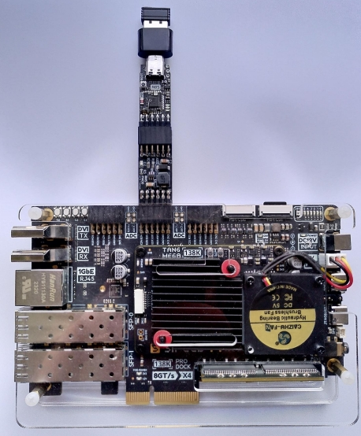

# A2600Nano on Tang Mega 138K pro

A2600Nano can be used in the [Tang Mega 138K pro](https://wiki.sipeed.com/hardware/en/tang/tang-mega-138k/mega-138k-pro.html).

The Tang Mega 138K is bigger than the other bords supported my
MiSTeryNano. Unlike the Tang Nano 20K which is actually slightly
inferior to the original [MiST](https://github.com/mist-devel/mist-board/wiki), the Tang Mega 138K is even slightly
more powerful than the MiST's successor [MiSTer](https://mister-devel.github.io/MkDocs_MiSTer/). So while the
MiSTeryNano core does run on the Tang Mega 138K it only utilizes its
FPGA to 14%.

Besides the significantly bigger FPGA over the Tang Nano 20K and also  
the Tang Primer 25K, the Tang Mega 138K adds several more features of  
which some can be used in the area of retro computing as well. 

Although the Tang Mega 138K comes with a significant ammount of  
DDR3-SDRAM, it also comes with a slot for the [Tang  
SDRAM](https://wiki.sipeed.com/hardware/en/tang/tang-PMOD/FPGA_PMOD.html#TANG_SDRAM). Using this board allows to use the same SDR-SDRAM memory access  
methods. DDR3 on the other hand is not supported by regular retro
implementations like the MiSTeryNano.

The M0S required to control the A2600Nano is to be mounted in the
middle PMOD with the help of the [M0S PMOD adapter](board/m0s_pmod).

Plug the optional Dualshock DS2x2 Interface into the left PMOD slot.
[PMOD DS2x2](https://wiki.sipeed.com/hardware/en/tang/tang-PMOD/FPGA_PMOD.html#PMOD_DS2x2) 
There is presently only one of the two DS sockets taken into use.

The whole setup will look like this:

The firmware for the M0S Dock is the same version as for the Tang
Nano 20K.

On the software side the setup is very simuilar to the original Tang Nano 20K based solution.  
The core needs to be built specifically for the different FPGA of the Tang Primer using either the [TCL script with the GoWin command line interface](build_tm138k_pro.tcl) or the
[project file for the graphical GoWin IDE](a2600nano_tm138k_pro.gprj).  
The resulting bitstream is flashed to the TP25K as usual.  And also the firmware for the M0S Dock is the [same version as for
the Tang Nano 20K](https://github.com/harbaum/FPGA-Companion). Latest binary can be found in the [release](http://github.com/harbaum/FPGA-Companion/releases) section.
